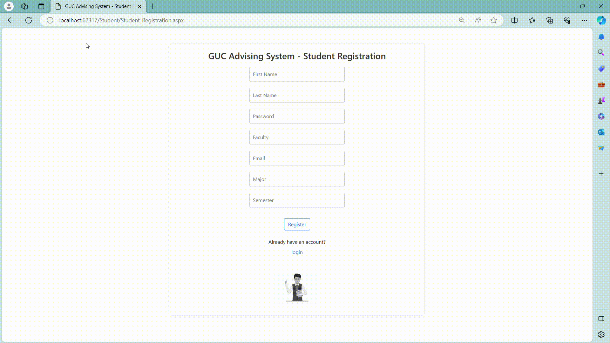
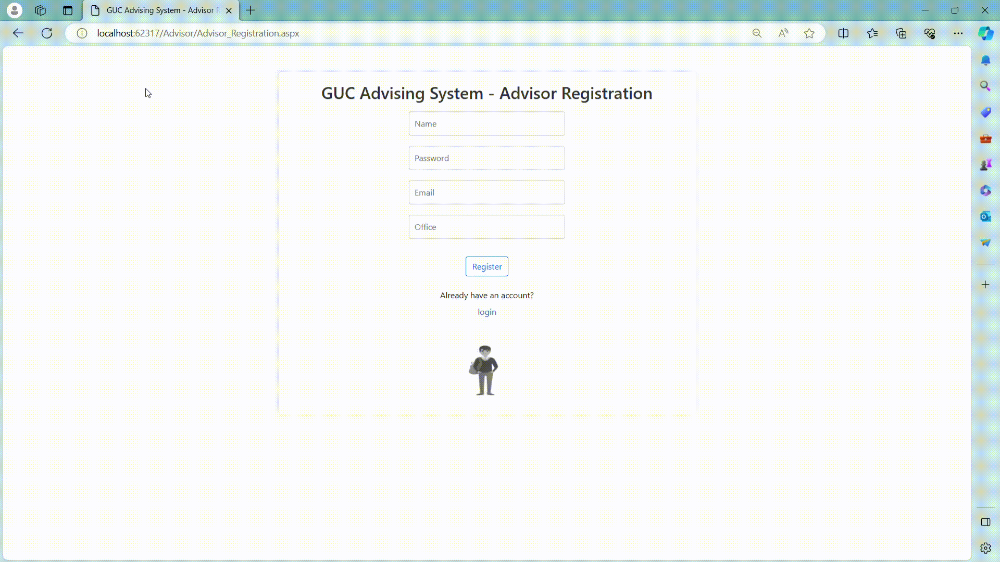
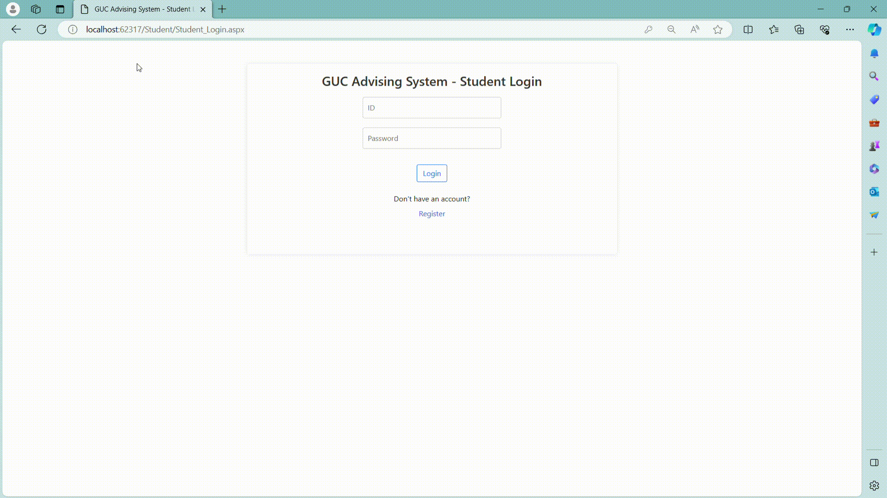

# Modified-Advising-System

## Description

The Modified-Advising-System project is a web-based application designed to streamline the academic advising process in an educational institution. It provides a platform for students, advisors, and administrators to efficiently manage and track various aspects of the advising process.

## Setup Guide

Here are the steps to set up the `Modified-Advising-System` project on your local machine:

### Prerequisites

- Visual Studio 2019 or later
- .NET Framework 4.7.2 or later
- SQL Server 2019 or later

### Steps

1. **Clone the repository**: Clone the `Modified-Advising-System` repository to your local machine using the following command in your terminal:

```bash
git clone https://github.com/yousefyasser/Modified-Advising-System.git
```

2. **Open the project**: Navigate to the cloned repository and open the `Advising_Team.sln` file in Visual Studio.

3. **Restore NuGet packages**: Right-click on the solution in Solution Explorer and select `Restore NuGet Packages`.

4. **Set up the database**: Run `Queries.sql` and then `m2 test.sql` scripts in SQL Server to set up the database.

5. **Update connection string**: Open the `Web.config` file and update the `connectionString` in the `connectionStrings` section with your SQL Server details.

6. **Build the project**: Press `Ctrl+Shift+B` to build the project.

7. **Run the project**: Press `F5` to run the project. The application should open in your default web browser.

### Credentials

| Role    | Username | Password |
| ------- | :------: | -------- |
| Student |    1     | pass     |
| Admin   |   666    | admin    |
| Advisor |    1     | pass     |

## Usage

Student System



Advisor System



Admin System



## Contributions

### Yousef Yasser (Student Component 1)

- Student's registration / login
- Student's courses details (available / missing / required / optional)
- Student sending request (course / credit hour) to his/her advisor
- Student / admin frontend

### Mostafa Hisham (Student Component 2)

- Student's makeup registration
- Student's upcoming unpaid installments
- Student's courses prerequisites and exams
- Slot's details

### Seifeldin Khaled (Advisor Component)

- Advisor's registration / login
- View assigned students
- View all requests
- Approve / reject requests (course / credit hour)
- Handle students graduation plans

### Mohamed Hefny (Admin Component 1)

- Add semester / course
- List advisors with their students
- Link student to advisor / course

### Rasheed Atia (Admin Component 2)

- Delete course / slot
- Display payments / installments / transcript for each student
- Update student status based on his/her financial status
- List semesters with their courses
- Add makeup exam for a course
- View graduation plans with their advisors
